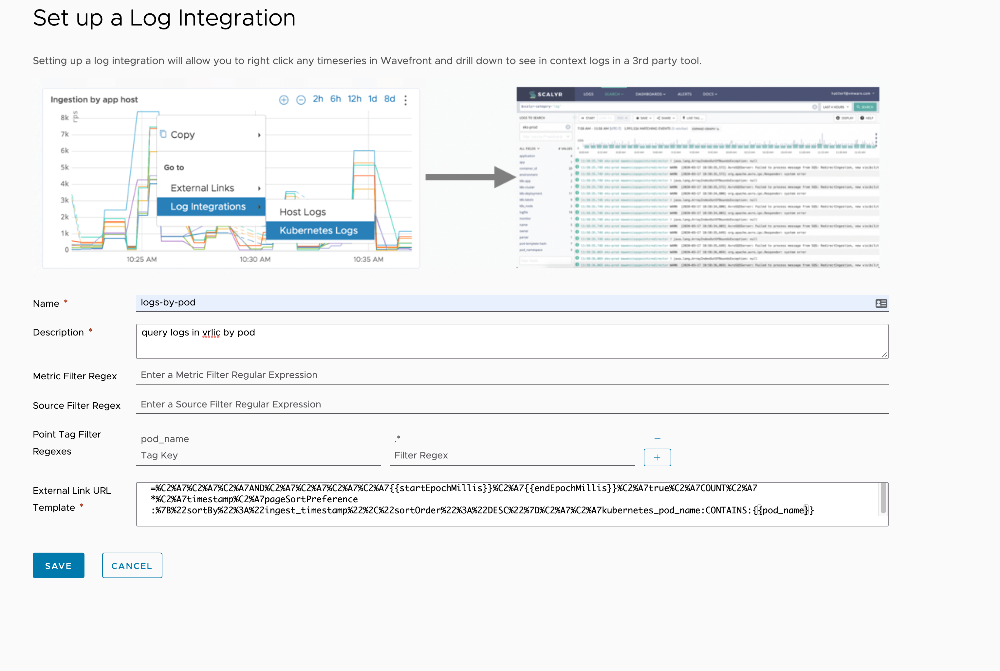
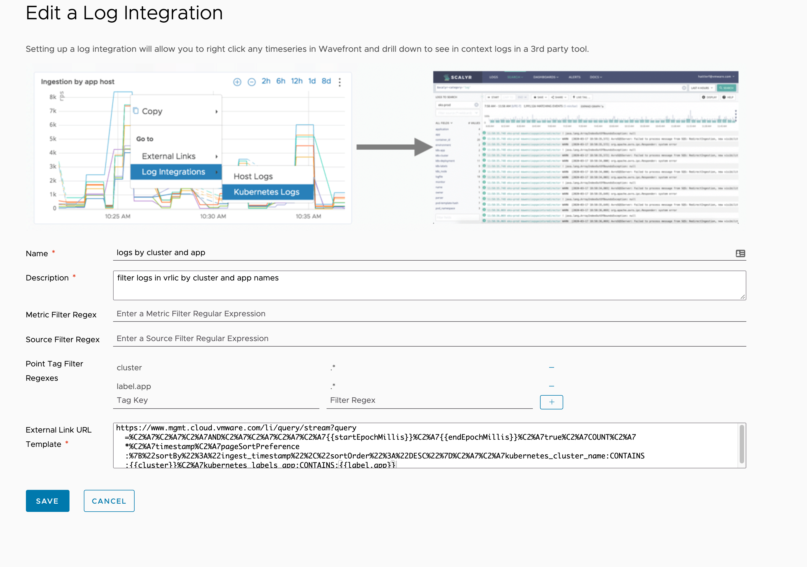

# Examples of Tanzu Observability integration for External links

## Overview

TO provides a way to embedd [external links](https://docs.wavefront.com/external_links_managing.html) that will use a template query string and link to inject items from a TO metric into a url to be used with things such as logging tools. This will go through some examples of doing that for K8s metrics with the default k8s dashboards in TO.


## Integrate with VRLIC

### Setup an external link to query logs based on app name

this will use the k8s label `app` to filter logs

1. create a new external link for log integration, this will add a regex match to only show the link when the `label.app` point tag exists. here is the raw query to use

```
https://www.mgmt.cloud.vmware.com/li/query/stream?query=%C2%A7%C2%A7%C2%A7AND%C2%A7%C2%A7%C2%A7%C2%A7{{startEpochMillis}}%C2%A7{{endEpochMillis}}%C2%A7true%C2%A7COUNT%C2%A7*%C2%A7timestamp%C2%A7pageSortPreference:%7B%22sortBy%22%3A%22ingest_timestamp%22%2C%22sortOrder%22%3A%22DESC%22%7D%C2%A7%C2%A7kubernetes_labels_app:CONTAINS:{{label.app}}
```


2. all metrics that have this point tag will now have a link under `log integrations` click that link and it will inject the value from `label.app` into the query string for VRLIC and launch a new window. Notice we are mapping the point tag `label.app` to the field in VRLIC `kubernetes_labels_app`


### Setup an external link to query logs based on node name

1. create a new external link for log integration, this will add a regex match to only show the link when the `nodename` point tag exists. here is the raw query to use

```
https://www.mgmt.cloud.vmware.com/li/query/stream?query=%C2%A7%C2%A7%C2%A7AND%C2%A7%C2%A7%C2%A7%C2%A7{{startEpochMillis}}%C2%A7{{endEpochMillis}}%C2%A7true%C2%A7COUNT%C2%A7*%C2%A7timestamp%C2%A7pageSortPreference:%7B%22sortBy%22%3A%22ingest_timestamp%22%2C%22sortOrder%22%3A%22DESC%22%7D%C2%A7%C2%A7kubernetes_host:CONTAINS:{{nodename}}
```


2.  all metrics that have this point tag will now have a link under `log integrations` click that link and it will inject the value from `nodename` into the query string for VRLIC and launch a new window. Notice we are mapping the point tag `nodename` to the field in VRLIC `kubernetes_host`


### Setup an external link to query logs based on pod


1. create a new external link for log integration, this will add a regex match to only show the link when the `pod_name` point tag exists. here is the raw query to use

```
https://www.mgmt.cloud.vmware.com/li/query/stream?query=%C2%A7%C2%A7%C2%A7AND%C2%A7%C2%A7%C2%A7%C2%A7{{startEpochMillis}}%C2%A7{{endEpochMillis}}%C2%A7true%C2%A7COUNT%C2%A7*%C2%A7timestamp%C2%A7pageSortPreference:%7B%22sortBy%22%3A%22ingest_timestamp%22%2C%22sortOrder%22%3A%22DESC%22%7D%C2%A7%C2%A7kubernetes_pod_name:CONTAINS:{{pod_name}}
```



2.  all metrics that have this point tag will now have a link under `log integrations` click that link and it will inject the value from `pod_name` into the query string for VRLIC and launch a new window. Notice we are mapping the point tag `pod_name` to the field in VRLIC `kubernetes_pod_name`


### Setup an external link to query logs based on app name and cluster name

NOTE: this requires a custom field added to the fluentd config for vrli, you can find that addition in the config [here](../vrlic-k8s.yml) just search for `kubernetes_cluster_name`

this will use the k8s label `app` to filter logs

1. create a new external link for log integration, this will add a regex match to only show the link when the `label.app` and `cluster` point tags exists. here is the raw query to use

```
https://www.mgmt.cloud.vmware.com/li/query/stream?query=%C2%A7%C2%A7%C2%A7AND%C2%A7%C2%A7%C2%A7%C2%A7{{startEpochMillis}}%C2%A7{{endEpochMillis}}%C2%A7true%C2%A7COUNT%C2%A7*%C2%A7timestamp%C2%A7pageSortPreference:%7B%22sortBy%22%3A%22ingest_timestamp%22%2C%22sortOrder%22%3A%22DESC%22%7D%C2%A7%C2%A7kubernetes_cluster_name:CONTAINS:{{cluster}}%C2%A7kubernetes_labels_app:CONTAINS:{{label.app}}
```




1. all metrics that have this point tag will now have a link under `log integrations` click that link and it will inject the value from `label.app` and `cluster` into the query string for VRLIC and launch a new window. Notice we are mapping the point tag `label.app` to the field in VRLIC `kubernetes_labels_app` and the point tag `cluster` to `kubernetes_cluster_name`
